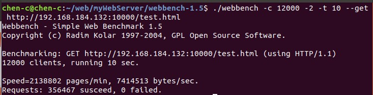

# chenWeb


## 项目描述

Linux下C++轻量级Web服务器，基于非阻塞I/O和模拟Proactor事件处理模式的高并发服务器，支持解析GET、POST请求，能够响应静态资源的请求。
 
- 使用线程池、非阻塞Socket、Epoll (LT模式)和模拟Proactor实现的并发模型；
- 使用状态机解析HTTP请求报文，支持GET和POST请求；
- 基于升序的双向链表实现的超时长连接清除，异步的日志系统；
- 访问服务器数据库实现Web端用户注册、登录功能，可以请求服务器图片和视频文件；
- 支持YAML文件配置。

## 在线访问

演示网站的地址：[http://web.blogca.cn/](http://web.blogca.cn/)

## 演示


## 目录

- [目录](#目录)
- [安装和使用](#安装和使用)
- [项目结构](#项目结构)
- [测试](#测试)
    - [压力测试](#压力测试)
    - [内存泄漏测试](#内存泄漏测试)
- [待添加功能](#待添加功能)
- [引用](#引用)

## 安装和使用
### 准备工作
* 服务器测试环境
    * Ubuntu版本18.04 / CentOS 7.6
    * MySQL版本5.7.38
* 浏览器测试环境
    * Windows、Linux均可
    * Chrome
    * edge

* 测试前确认已安装MySQL数据库

```mysql
# 建立 webserver 库
create database webserver;

# 创建user表
USE webserver;
CREATE TABLE user(
    username char(50) NULL,
    password char(50) NULL
)ENGINE=InnoDB;

# 添加数据
INSERT INTO user(username, password) VALUES('chen', '12345678');
```

* 修改config.yaml中的数据库初始化信息

```yaml
# 数据库相关参数
databaseParameter:
  # 登录用户名
  user: "chen"
  # 登录密码
  passwd: "12345678"
  # 数据库名称
  databasename: "webserver"
```

### 服务器端代码编译构建 （以下方式选其一即可）
> 方式1无需手动配置yaml相关依赖，方式2需手动配置yaml相关依赖
#### 方式1： CMake编译构建 (仅限ubuntu使用)

**环境：**
- cmake >= 3.20
- gcc 7.5.0

1. 构建编译
```bash
cd 当前目录
sh ./build.sh
```
2. 运行
```bash
./bin/chenWeb
```


#### 方式2：makefile编译构建(ubuntu、centos均可使用)
**环境：**
- cmake >= 3.20
- gcc
- g++


1. 需要先配置yaml-cpp
```bash
// yaml-cpp 配置
git clone https://github.com/jbeder/yaml-cpp.git
cd yaml-cpp/
mkdir build && cd build
cmake .. && make -j
sudo make install
```

2. 构建编译本项目
```c++
// chenWeb 配置
cd 当前目录
sh ./build-centos.sh
```
3. 运行
```c++
./chenWeb
```

### 浏览器端运行
```c++
ip:10000/
```

## 项目结构

```bash
chenWeb/

|-- config_/                             # yaml配置文件解析相关
|-- http/                                # http连接处理解析
|-- lock_/                               # 互斥锁
|-- log/                                 # 日志
|-- pool/                                # 线程池
|-- utils/                            	 # 工具类
|-- webserver/                           # 入口函数类
|-- include/                             # 依赖的第三方库的头文件
|   |--yaml-cpp/                         # yaml配置文件解析
|-- lib/                                 # 依赖的第三方库
|   |--yaml-cpp/                         # yaml配置文件解析
|-- config_.yaml                         # 配置文件
|-- main.cpp                             
|-- CMakeLists.txt
|-- makefile     
|-- build.sh
|-- README.md
```

## 测试
### 压力测试
#### 测试环境：ubuntu18,
#### 虚拟机配置：


#### 测试方式：模拟Proactor模式，关闭日志后，使用Webbench对服务器进行压力测试，对listen_fd和client_fd分别采用LT和ET模式，均可实现12000+的并发。

- listen_fd: LT, client_fd: LT, QPS: 37133


- listen_fd: ET, client_fd: LT, QPS: 41639


- listen_fd: LT, client_fd: ET, QPS: 35646



- listen_fd: ET, client_fd: ET, QPS: 44153


### 内存泄漏测试
- 已测试，无泄漏, 测试方法如下
```bash
G_SLICE=always-malloc G_DEBUG=gc-friendly  valgrind -v --tool=memcheck --time-stamp=yes --leak-check=full --num-callers=40 --log-file=valgrind_Server.log ./bin/chenWeb
```

## 待添加功能
1、http解析使用正则表达式

2、上传/下载文件

3、解析更多的http头部字段

4、加入cookie或者session验证

5、密码MD5加密

6、注册时候加入验证码


## 引用
1. [Github jbeder/yaml-cpp](https://github.com/jbeder/yaml-cpp)

